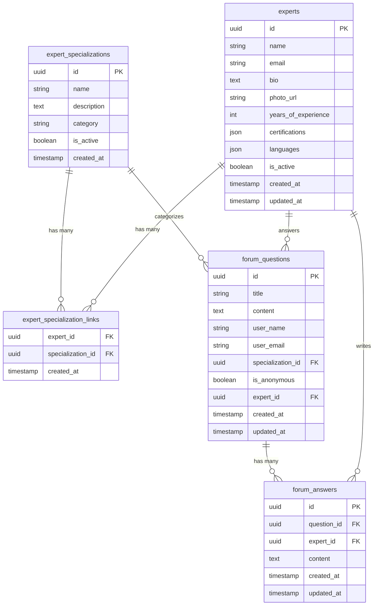
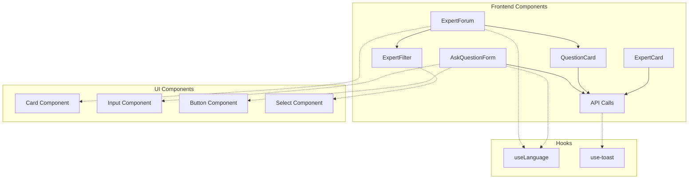
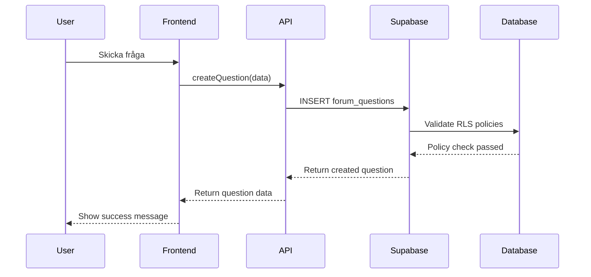

# Expertforum - Tekniskt Flödeschema

## 🔄 Dataflöde och API-anrop

```mermaid
graph TD
    A[Frontend: Next.js App Router] --> B[API Layer: forum.ts]
    B --> C[Supabase Client]
    C --> D[PostgreSQL Database]
    
    A1[/forum] --> B1[getExperts()]
    A2[/forum/ask] --> B2[createQuestion()]
    A3[/experts] --> B3[getQuestions()]
    A4[/experts/[id]] --> B4[getExpertById()]
    
    B1 --> C1[supabase.from('experts')]
    B2 --> C2[supabase.from('forum_questions')]
    B3 --> C3[supabase.from('forum_questions')]
    B4 --> C4[supabase.from('experts')]
    
    C1 --> D1[experts table]
    C2 --> D2[forum_questions table]
    C3 --> D3[forum_questions + forum_answers]
    C4 --> D4[experts table]
```

## 📊 Databas-schema med Relationer



## 🏗️ Komponent-arkitektur



## 🔄 API-endpoint Detaljer

### getExperts()
```typescript
// src/lib/forum.ts
async function getExperts(filters?: ExpertFilters): Promise<Expert[]> {
  let query = supabase
    .from('experts')
    .select(`
      *,
      expert_specialization_links!inner(
        expert_specializations!inner(*)
      )
    `)
    .eq('is_active', true);
    
  if (filters?.specialization) {
    query = query.eq('expert_specialization_links.expert_specializations.name', filters.specialization);
  }
  
  return query;
}
```

### createQuestion()
```typescript
// src/lib/forum.ts
async function createQuestion(data: QuestionData): Promise<Question> {
  return supabase
    .from('forum_questions')
    .insert([{
      title: data.title,
      content: data.content,
      user_name: data.userName,
      user_email: data.userEmail,
      specialization_id: data.specializationId,
      is_anonymous: data.isAnonymous,
      expert_id: data.expertId
    }])
    .select()
    .single();
}
```

### getQuestions()
```typescript
// src/lib/forum.ts
async function getQuestions(filters?: QuestionFilters): Promise<Question[]> {
  return supabase
    .from('forum_questions')
    .select(`
      *,
      expert_specializations!inner(*),
      forum_answers(
        *,
        experts!inner(*)
      )
    `)
    .order('created_at', { ascending: false });
}
```

## 📚 Bibliotek och Dependencies

### Core Dependencies
```json
{
  "next": "^14.0.0",
  "react": "^18.0.0",
  "react-dom": "^18.0.0",
  "typescript": "^5.0.0"
}
```

### UI & Styling
```json
{
  "tailwindcss": "^3.0.0",
  "lucide-react": "^0.300.0",
  "@headlessui/react": "^1.7.0"
}
```

### Backend & Database
```json
{
  "@supabase/supabase-js": "^2.0.0",
  "@supabase/auth-helpers-nextjs": "^0.8.0"
}
```

### Utilities
```json
{
  "date-fns": "^2.30.0",
  "sonner": "^1.0.0"
}
```

## 🔒 Säkerhetsflöde



## 📊 Prestanda-optimeringar

### Database Index
```sql
-- Index för snabbare sökningar
CREATE INDEX idx_experts_active ON experts(is_active);
CREATE INDEX idx_questions_specialization ON forum_questions(specialization_id);
CREATE INDEX idx_questions_created_at ON forum_questions(created_at DESC);
CREATE INDEX idx_answers_question ON forum_answers(question_id);
```

### Caching Strategy
```typescript
// Next.js App Router caching
export const revalidate = 60; // Revalidate varje minut
export const dynamic = 'force-dynamic'; // För användarspecifik data
```

## 🌐 Språkhantering

```typescript
// src/hooks/useLanguage.tsx
const translations = {
  sv: {
    forum: 'Forum',
    askQuestion: 'Ställ en fråga',
    experts: 'Experter',
    specializations: 'Specialiseringar'
  },
  en: {
    forum: 'Forum',
    askQuestion: 'Ask a Question',
    experts: 'Experts',
    specializations: 'Specializations'
  }
};
```

## 📁 Projektstruktur

```
src/
├── app/
│   ├── forum/
│   │   ├── page.tsx
│   │   └── ask/page.tsx
│   ├── experts/
│   │   ├── page.tsx
│   │   └── [id]/page.tsx
│   └── layout.tsx
├── components/
│   ├── forum/
│   │   ├── ExpertForum.tsx
│   │   ├── AskQuestionForm.tsx
│   │   ├── QuestionCard.tsx
│   │   └── ExpertCard.tsx
│   └── ui/
│       ├── input.tsx
│       ├── label.tsx
│       └── textarea.tsx
├── lib/
│   ├── api/
│   │   └── forum.ts
│   └── supabase.ts
├── hooks/
│   ├── useLanguage.tsx
│   └── use-toast.tsx
└── types/
    └── forum.ts
```

## 🚀 Deployment & Miljö

### Miljövariabler
```env
NEXT_PUBLIC_SUPABASE_URL=your_supabase_url
NEXT_PUBLIC_SUPABASE_ANON_KEY=your_anon_key
SUPABASE_SERVICE_ROLE_KEY=your_service_role_key
```

### Build Process
```bash
npm run build    # Bygg produktion
npm run start    # Starta produktionsserver
npm run dev      # Utvecklingsserver
```

Detta tekniska flödeschema visar alla kopplingar mellan frontend, API-lager, databas och externa bibliotek i expertforum-systemet för ayurveda och TCM.